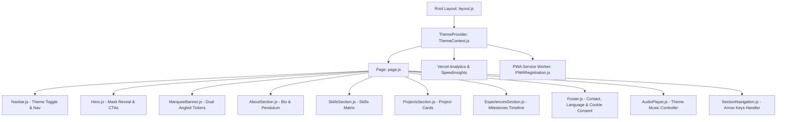

# 🕷️ Mahin Gunjal — Web Designer & VFX Artist Portfolio

> A high-performance, interactive, and fully accessible portfolio web application crafted for **Mahin Gunjal**, Web Designer & VFX Artist. Built with **Next.js 16 (App Router)**, **React 19**, **Tailwind CSS v4**, **GSAP**, and integrated with **Vercel Analytics & Speed Insights**.

---

## 📑 Table of Contents

- [Overview](#-overview)
- [Architecture & Flow](#-architecture--flow)
- [Key Features](#-key-features)
- [Tech Stack & Dependencies](#-tech-stack--dependencies)
- [Project Directory Structure](#-project-directory-structure)
- [Core Components Breakdown](#-core-components-breakdown)
- [Theme Engine (Spider-Man vs. Venom)](#-theme-engine-spider-man-vs-venom)
- [Google Translate Integration & Suppression](#-google-translate-integration--suppression)
- [SEO, JSON-LD Schema & Sitemap](#-seo-json-ld-schema--sitemap)
- [Performance & Lighthouse Optimization](#-performance--lighthouse-optimization)
- [Keyboard Accessibility & Shortcuts](#-keyboard-accessibility--shortcuts)
- [Getting Started](#-getting-started)
- [Available Scripts](#-available-scripts)
- [Deployment](#-deployment)
- [Legal & Compliance](#-legal--compliance)
- [Credits & Author](#-credits--author)

---

## 🌟 Overview

This portfolio serves as the professional digital presence and creative showcase of **Mahin Gunjal**. The design combines superhero themes (Classic Spider-Man Red vs. Venom Symbiote Purple/Dark), smooth physics-based pendulum animations, interactive cursor mask reveals, high-contrast neubrutalism cards, multi-language translation, and ambient theme music.

---

## 📐 Architecture & Flow



---

## ✨ Key Features

1. **Interactive Dual-Layer Mask Reveal Hero**:
   - Moves dynamic `radial-gradient` mask on desktop cursor position (`Spider_Man.png` suit mask reveals `Mahin_Man.jpeg` unmasked face underneath).
   - Auto-detects touch/mobile devices (`ontouchstart` and `hover: none`) and safely falls back to standard rendering.

2. **Spider-Man Red & Venom Symbiote Dark Mode**:
   - High-contrast dual theme engine managed by `ThemeContext.js`.
   - Smoothly shifts color palettes (Spider-Man `#a31515` vs. Venom `#7e22ce` / `#050508`), shadows, glows, and image filters across the entire DOM with localStorage persistence.

3. **Background Theme Audio Controller**:
   - Floating audio widget streaming original Spider-Man score (`Spider_Man.mp3`).
   - Spacebar global keyboard toggle listener (bypassed inside input/textarea fields).
   - Animated visual audio equalizer indicator bars.

4. **Multi-Language Google Translate Widget (20 Languages)**:
   - Supports 20 Indian and international languages (English, Hindi, Gujarati, Marathi, Bengali, Tamil, Telugu, Kannada, Malayalam, Odia, Punjabi, Sanskrit, and more).
   - **Zero Header Shift**: Completely hides Google Translate's iframe top bar, floating balloons, gadget branding, and prevents unwanted `body` top margin shifts.

5. **GSAP Physics & Pendulum Animations**:
   - ScrollTrigger-driven dropping web lines with bounce easing (`bounce.out`).
   - Continuous hanging pendulum photo frame and Spider-Man upside-down swing loops.

6. **Full Keyboard & Screen-Reader Accessibility (WCAG 2.1 AA/AAA)**:
   - `<a href="#main-content">` skip navigation button.
   - Arrow Up / Arrow Down keys navigate smoothly through sections.
   - Contrast ratios exceeding 7:1 for crisp readability.

7. **Vercel Analytics & Speed Insights**:
   - Real-time real-user monitoring (RUM), page views, visitors, and Core Web Vitals (LCP, FID/INP, CLS).

8. **Automated SEO & XML Sitemap**:
   - Full OpenGraph & Twitter Card metadata with canonical URLs.
   - Dynamic `sitemap.xml` generated via `src/app/sitemap.js`.
   - Dynamic `robots.txt` generated via `src/app/robots.js`.
   - Rich JSON-LD Structured Data Schema (`Person`, `WebSite`, `ProfilePage`).

---

## 🛠️ Tech Stack & Dependencies

| Category | Technology / Library | Version | Description |
| :--- | :--- | :--- | :--- |
| **Framework** | [Next.js](https://nextjs.org/) | `16.3.1` | React App Router framework with Turbopack |
| **UI Library** | [React](https://react.dev/) | `19.2.8` | Next-generation React core & DOM |
| **Styling** | [Tailwind CSS](https://tailwindcss.com/) | `v4.x` | Modern utility-first CSS framework |
| **Animations** | [GSAP](https://gsap.com/) | `3.15.0` | GreenSock Animation Platform & ScrollTrigger |
| **Analytics** | [@vercel/analytics](https://www.npmjs.com/package/@vercel/analytics) | `latest` | Privacy-focused user and traffic analytics |
| **Performance** | [@vercel/speed-insights](https://www.npmjs.com/package/@vercel/speed-insights) | `latest` | Core Web Vitals performance telemetry |
| **Typography** | Geist Sans & Geist Mono | Next Fonts | Crisp geometric typography |

---

## 📁 Project Directory Structure

```
Mahin_Portfolio/
├── public/
│   ├── Assets/
│   │   ├── Mahin.jpeg              # Profile portrait for About section pendulum
│   │   ├── Mahin_Man.jpeg          # Unmasked portrait base layer in Hero
│   │   ├── Spider_Man.png          # Masked suit overlay layer in Hero
│   │   ├── Spider_Man.mp3          # Ambient theme background music
│   │   ├── Web.png                 # Spider web decorative accent
│   │   ├── spidey_gif_1.png        # Upside-down hanging Spider-Man graphic
│   │   └── spidey_gif_2.png        # Peeking corner Spider-Man graphic
│   ├── favicon/                    # Multi-size favicons (96x96, 192x192, 512x512, SVG)
│   ├── Mahin_Resume.pdf            # Downloadable professional curriculum vitae
│   ├── manifest.json               # PWA web app manifest
│   └── sw.js                       # Service Worker for offline PWA caching
├── src/
│   ├── app/
│   │   ├── PrivacyPolicy/
│   │   │   └── page.js             # DPDP Act 2023 compliant privacy policy
│   │   ├── T&C/
│   │   │   └── page.js             # IT Act 2000 compliant terms & conditions
│   │   ├── error.js                # Global 500 runtime error boundary
│   │   ├── globals.css             # Tailwind imports & Google Translate CSS overrides
│   │   ├── layout.js               # Root layout, fonts, SEO metadata, JSON-LD schema
│   │   ├── loading.js              # Spider-Man spinner & skeleton wireframes
│   │   ├── not-found.js            # Custom 404 page with Spider-Man graphics
│   │   ├── page.js                 # Main landing page assembling all components
│   │   ├── robots.js               # Dynamic robots.txt crawler route
│   │   └── sitemap.js              # Dynamic XML sitemap generator
│   ├── components/
│   │   ├── AboutSection.js         # Bio, academic details, and pendulum photo
│   │   ├── AudioPlayer.js          # Background theme audio player & shortcuts
│   │   ├── ExperiencesSection.js   # Career timeline with connected web thread
│   │   ├── Footer.js               # Email copy, language selector, DPDP cookie card
│   │   ├── Hero.js                 # Interactive cursor-tracking mask reveal hero
│   │   ├── MarqueeBanner.js        # Dual 3D-angled infinite ticker ribbons
│   │   ├── Navbar.js               # Sticky glassmorphic navbar with theme toggle
│   │   ├── ProjectsSection.js      # Featured project cards and external links
│   │   ├── PWARegistration.js      # Service worker registration component
│   │   ├── SectionNavigation.js    # Keyboard arrow navigation handler
│   │   ├── SkillsSection.js        # Technical proficiencies grid
│   │   └── TextType.js             # Typing text animation utility
│   └── context/
│       └── ThemeContext.js         # Spider-Man Light vs. Venom Dark state provider
├── next.config.mjs                 # Next.js configuration
├── package.json                    # Project dependencies & scripts
└── README.md                       # Comprehensive codebase documentation
```

---

## 🧩 Core Components Breakdown

### 1. `Hero.js`
- Renders the interactive mask reveal effect via CSS radial gradient masking.
- Handles mouse coordinates with bounding box checks.
- Contains direct download CTA for `Mahin_Resume.pdf` and smooth scrolling to `#projects`.

### 2. `AboutSection.js`
- GSAP ScrollTrigger timeline triggering falling spider webs and profile pendulum drop.
- Displays bio, education at ITM SLS Baroda University, and VFX specialization at ZICA.
- Lists primary tech stack tags with tactile click feedback.

### 3. `SkillsSection.js`
- Displays 13+ technical skills (Blender, Autodesk Maya, After Effects, Premiere Pro, Figma, WordPress, Prompt Engineering, HTML/CSS).
- Features hanging upside-down Spider-Man graphic with continuous sine pendulum rotation.
- Features origin-left background expand hover effects on each skill card.

### 4. `ProjectsSection.js`
- Displays 2x2 responsive grid of featured software engineering and web application projects.
- Includes corner peeking Spider-Man animation oscillating vertically.
- Contains external links to GitHub repositories.

### 5. `ExperiencesSection.js`
- Alternating vertical timeline showcasing professional experience, internships, leadership roles, and administrative work.
- Connected by a central glowing gradient thread node line.

### 6. `Footer.js`
- "Work With Me" section with one-click clipboard copy (`mahingunjal@gmail.com`).
- Legal navigation to `/T&C` and `/PrivacyPolicy`.
- Social connect links (GitHub, LinkedIn, Instagram).
- Custom 20-language Google Translate select menu with automatic top-banner offset neutralization.
- DPDP Act 2023 cookie consent banner.

### 7. `AudioPlayer.js`
- Controls ambient playback of `Spider_Man.mp3`.
- Listens to global Spacebar keypresses to toggle play/pause without interfering with typing.
- Persists music preference in `localStorage`.

### 8. `SectionNavigation.js`
- Listens to ArrowUp / ArrowDown key events to navigate sequentially through page sections (`#main-content`, `#about`, `#skills`, `#projects`, `#experiences`, `#contact`).

---

## 🎨 Theme Engine (Spider-Man vs. Venom)

The theme engine is orchestrated through `ThemeContext.js` and consumed across components via the `useTheme()` hook.

- **Spider-Man Red Mode**:
  - Background: Clean `#ffffff` with dark glassmorphic cards
  - Accent Color: `#a31515` (Crimson Red) & `#ef4444`
  - Glows: Red shadows (`shadow-red-950/20`)

- **Venom Symbiote Mode**:
  - Background: Deep Obsidian `#050508` / `#0a0a10`
  - Accent Color: `#7e22ce` / `#9333ea` (Symbiote Purple)
  - Glows: Purple luminescent glows (`shadow-purple-950/40`)
  - Image Filters: High contrast symbiote styling with purple aura drops

---

## 🌐 Google Translate Integration & Suppression

Google Translate injects iframe toolbars and modifies `document.body.style.top = "40px"`. This portfolio uses a multi-layer strategy to completely suppress visual header shifts:

1. **CSS Overrides (`globals.css`)**:
   - Suppresses `.goog-te-banner-frame`, `.VIpgJd-ZGain-r42b1d`, `#goog-gt-tt`, `.goog-tooltip`, and `body > .skiptranslate`.
   - Forces `html, body { top: 0px !important; margin-top: 0px !important; }`.

2. **JavaScript MutationObserver (`Footer.js`)**:
   - Actively observes inline style mutations on `document.body` and `document.documentElement`.
   - Instantly resets any non-zero `top` style attribute to `0px !important`.

---

## 🔍 SEO, JSON-LD Schema & Sitemap

- **Metadata Base**: `https://mahingunjal.com`
- **Dynamic XML Sitemap**: Generated at `/sitemap.xml` through `src/app/sitemap.js`.
- **Dynamic Robots**: Generated at `/robots.txt` through `src/app/robots.js`.
- **Structured Data (JSON-LD)**: Schema.org `@graph` comprising `Person`, `WebSite`, and `ProfilePage` types.
- **OpenGraph & Twitter**: 1200x630 high-resolution social preview image (`/Assets/Mahin.jpeg`).

---

## ⚡ Performance & Lighthouse Optimization

- **Turbopack Build Engine**: Instant Hot Module Replacement (HMR) and optimized static page generation.
- **Font Optimization**: `next/font/google` with `display: swap` for zero layout shift (CLS).
- **GPU Acceleration**: `transform: translateZ(0)` and `will-change` on infinite tickers to offload animation rendering to the GPU.
- **Passive Event Listeners**: Scroll and touch listeners configured with `{ passive: true }`.
- **Lazy Loading**: Native browser lazy loading on non-critical images and assets.

---

## ⌨️ Keyboard Accessibility & Shortcuts

| Key / Combination | Action |
| :--- | :--- |
| <kbd>Tab</kbd> (on initial load) | Focuses the "Skip to main content" WCAG link |
| <kbd>Spacebar</kbd> | Toggles background theme music on/off |
| <kbd>↓</kbd> (Down Arrow) | Smoothly scrolls to the next portfolio section |
| <kbd>↑</kbd> (Up Arrow) | Smoothly scrolls to the previous portfolio section |

---

## 🚀 Getting Started

### Prerequisites
- [Node.js](https://nodejs.org/) (v18.17.0 or higher recommended)
- `npm` (v9.0.0 or higher)

### Installation

1. Clone repository:
   ```bash
   git clone https://github.com/NisargDelvadiya/Mahin_Portfolio.git
   cd Mahin_Portfolio
   ```

2. Install dependencies:
   ```bash
   npm install
   ```

3. Start development server:
   ```bash
   npm run dev
   ```

4. Open your browser and navigate to `http://localhost:3000`.

---

## 📜 Available Scripts

| Command | Description |
| :--- | :--- |
| `npm run dev` | Starts local Next.js development server with Turbopack |
| `npm run build` | Builds optimized production bundle |
| `npm run start` | Runs production server locally after build |
| `npm run lint` | Runs ESLint checks across codebase |

---

## 🚢 Deployment

The easiest way to deploy this application is using [Vercel](https://vercel.com/):

1. Push your latest code to GitHub.
2. Import the repository into your Vercel Dashboard.
3. Vercel automatically detects Next.js, configures build settings, and enables **Vercel Analytics** and **Speed Insights** automatically.
4. Add your custom domain (e.g. `mahingunjal.com`).

---

## ⚖️ Legal & Compliance

- **Digital Personal Data Protection (DPDP) Act 2023 of India**: Zero personal data harvesting, explicit functional cookie consent banner.
- **Information Technology Act 2000 of India**: Intellectual property rights and terms of website use clearly outlined in `/T&C`.
- **WCAG 2.1 Level AA/AAA**: High-contrast ratios, keyboard focus rings, semantic tags, and screen-reader ARIA descriptions.

---

## 👨‍💻 Credits & Author

- **Portfolio Owner**: [Mahin Gunjal](https://mahingunjal.com) — Web Designer & VFX Artist
- **Lead Developer**: [Nisarg Delvadiya](https://nisargjayeshdelvadiya.com)
- **UI Design Inspiration**: [@srii_tech_](https://www.instagram.com/srii_tech_)
