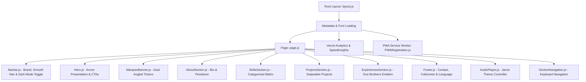

# ⚡ Nisarg Jayesh Delvadiya — Full-Stack Engineer & Co-Founder Portfolio

> A high-performance, interactive, and accessible portfolio web application engineered for **Nisarg Jayesh Delvadiya**, Full-Stack Engineer and Co-Founder at **Duo Brothers**. Built with **Next.js 16 (App Router)**, **React 19**, **Tailwind CSS v4**, **GSAP**, and integrated with **Vercel Analytics & Speed Insights**.

---

## 📑 Table of Contents

- [Overview](#-overview)
- [Architecture & Flow](#-architecture--flow)
- [Key Features](#-key-features)
- [Tech Stack & Dependencies](#-tech-stack--dependencies)
- [Project Directory Structure](#-project-directory-structure)
- [Core Components Breakdown](#-core-components-breakdown)
- [Google Translate Integration](#-google-translate-integration)
- [SEO, JSON-LD Schema & Sitemap](#-seo-json-ld-schema--sitemap)
- [Keyboard Accessibility & Shortcuts](#-keyboard-accessibility--shortcuts)
- [Getting Started](#-getting-started)
- [Available Scripts](#-available-scripts)
- [Security & Compliance](#-security--compliance)
- [Credits & Author](#-credits--author)

---

## 🌟 Overview

This portfolio serves as the official professional digital presence and creative showcase of **Nisarg Jayesh Delvadiya**. The design combines modern full-stack web engineering, an Iron Man Stark Industries aesthetic (rich Crimson `#AA0505`, Burgundy `#6A0C0B`, and Arc Reactor Gold `#FBCA03`), a premium seamless Night Mode, smooth physics-based pendulum portrait animations, horizontal swipeable carousels, 20-language translation, ambient Jarvis audio, and complete mobile responsiveness.

---

## 📐 Architecture & Flow



---

## ✨ Key Features

1. **Hero Armor & Stark Presentation**:
   - High-impact armor hero layer with entrance typography powered by GSAP.
   - Quick CTAs for project exploration and direct resume PDF download.

2. **Dual Angled Skills Ticker (Marquee Banner)**:
   - High-speed dual opposing ticker bands tilted at +3deg and -4deg angles.
   - Showcases technologies (Next.js, Sarvam AI, React, Node.js) and cultural domains (Indology, Sanskrit, Bharatiya History, Cinephile for Bharatiya Cinema) separated by Iron Man mask marks.

3. **Pendulum Physics Portrait**:
   - Realistic swinging pendulum animation on the profile portrait using GSAP easing (`sine.inOut`).

4. **Interactive Categorized Skills Matrix**:
   - Filterable skills divided into **Management & Leadership Skills** and **Technical & Engineering Skills**.
   - Hover card expansion animations with contrast-safe tokens.

5. **Swipeable Featured Projects**:
   - Carousel featuring Bookified, Mahin Gunjal Portfolio, Priyanka Gunjal Portfolio, Artezen, and Real Estate Platform.
   - Touch swipe gesture support and keyboard arrow navigation.

6. **Duo Brothers Experience Showcase**:
   - Features the official Duo Brothers brand emblem (`/Assets/Duo_Brothers.png`) and milestones.

7. **Ambient Jarvis Audio Player**:
   - Floating audio widget with real-time waveform visualizer bars synchronized to the audio state.
   - Keyboard toggle via `Spacebar`.

8. **Premium Night Mode (Dark Theme)**:
   - Deep carbon black and zinc gray UI scaling seamlessly across the Hero, About, Skills, Projects, and Experiences sections.
   - Smooth manual toggle natively located in the Navbar for immediate user control.

9. **20-Language Google Translate & Fullscreen Access**:
   - Seamless multilingual translation covering English, Hindi, Gujarati, Sanskrit, and global languages.
   - Native one-click full screen toggle to provide an immersive app-like viewing experience.

---

## 🛠️ Tech Stack & Dependencies

- **Framework**: Next.js 16 (App Router)
- **Library**: React 19 & React DOM 19
- **Styling**: Tailwind CSS v4 & PostCSS
- **Animation**: GreenSock Animation Platform (GSAP 3)
- **Telemetry**: `@vercel/analytics` & `@vercel/speed-insights`

---

## 🚀 Getting Started

### Prerequisites
- Node.js 18.17+ or 20+
- npm 9+

### Installation & Run

```bash
# Clone the repository
git clone https://github.com/NisargDelvadiya/Mahin_Portfolio.git
cd Nisarg_Portfolio

# Install dependencies
npm install

# Start development server
npm run dev

# Open http://localhost:3000
```

---

## ⌨️ Keyboard Accessibility & Shortcuts

| Shortcut | Action | Scope |
| :------- | :----- | :---- |
| `↑` (Arrow Up) | Smooth scroll to previous portfolio section | Global (ignoring inputs) |
| `↓` (Arrow Down) | Smooth scroll to next portfolio section | Global (ignoring inputs) |
| `←` (Arrow Left) | Navigate to previous project / experience card | While viewing carousels |
| `→` (Arrow Right) | Navigate to next project / experience card | While viewing carousels |
| `Spacebar` | Toggle ambient Jarvis audio on / off | Global (ignoring inputs) |

---

## 🔒 Security & Compliance

- **DPDP Act 2023 Compliant**: Zero personal identity data harvesting.
- **Content Security Policy**: Strict CSP headers applied.
- See [SECURITY.md](file:///Users/nisargdelvadiya/Desktop/Nisarg_Portfolio/SECURITY.md) for vulnerability disclosure details.
- See [ARCHITECTURE.md](file:///Users/nisargdelvadiya/Desktop/Nisarg_Portfolio/ARCHITECTURE.md) for system design specifications.
- See [CONTRIBUTING.md](file:///Users/nisargdelvadiya/Desktop/Nisarg_Portfolio/CONTRIBUTING.md) for contribution guidelines.

---

## 👤 Credits & Author

- **Author**: Nisarg Jayesh Delvadiya
- **Role**: Full-Stack Engineer & Co-Founder at Duo Brothers
- **Website**: [https://nisargjayeshdelvadiya.com](https://nisargjayeshdelvadiya.com)
- **Email**: [nisarg.delvadiya1@zohomail.in](mailto:nisarg.delvadiya1@zohomail.in)
- **GitHub**: [@NisargDelvadiya](https://github.com/NisargDelvadiya)
- **Blog**: [The Nisarg Critic](https://thenisargcritic.blogspot.com)
- **Co-Partner**: Mahin Sidhartha Gunjal ([Spidey Portfolio](https://mahin-portfolio-spidey.vercel.app))
